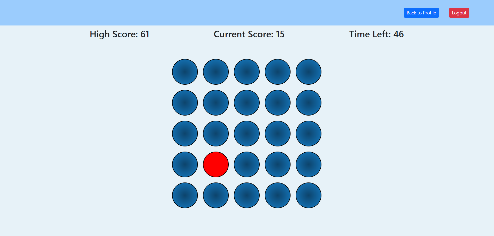

# NeuroFlow

NeuroFlow is a full-stack web application that empowers users to improve and maintain their cognitive health through engaging tests and a personalized progress-tracking profile chart.

[Check out the site!](https://neuroflow.onrender.com/)

## How It's Made:
Tech used: 
- EJS
- CSS
- JS
- Express
- passport
- Node.js
- [D3.js](https://d3js.org/)
- MongoDB

## Features

- users can login and choose from three cognitive tests to sharpen their abilities
    - Reaction Test (practice reaction time by clicking the red circles)
    - Active Recall Test (recall the presented series of shapes, which increase in length after each successful attempt)
    - Number Sequence Test (recognize the given pattern of numbers and fill in the missing number from the sequence)

- progress tracking for last ten test attempts for each type of test
    - NeuroFlow utilizes JavaScript's [D3](https://d3js.org/) library to dynamically draw line graphs. The user's ten most recent scores for each test are fetched from the server, and SVG containers are created. Line graphs for each test are drawn in these containers and displayed on the profile page.

- ability to delete progress for each type of test

## Future Goals

- improve styling
- add more cognitive tests
