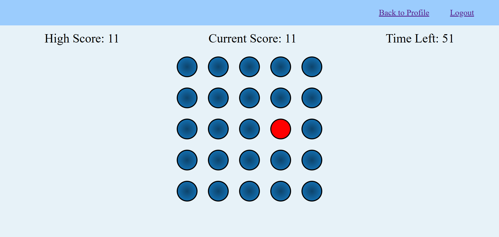

Link to project: () (WORK IN PROGRESS)

## How It's Made:
Tech used: EJS, CSS, JS, passport, Node.js

- NeuroFlow is a full-stack web application that empowers users to improve and maintain their cognitive health through engaging tests and a personalized progress-tracking profile chart.
